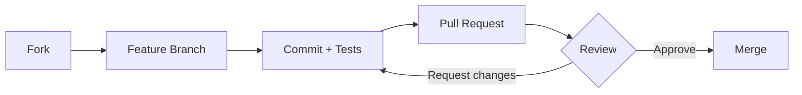

<h1 align="center">Netflix-Style Portfolio</h1>

<p align="center">
  Cinematic, Netflix-inspired storytelling site built with Next.js App Router, Material UI, Redux Toolkit, slick sliders, and custom audio orchestration.
</p>

<p align="center">
  <a href="https://nodejs.org/en/">=18" src="https://img.shields.io/badge/node-%3E%3D18-339933?logo=node.js&logoColor=white"></a>
  <a></a>
  <a></a>
  <a></a>
  <a></a>
  <a></a>
  <a></a>
  <a></a>
  <a href="https://github.com/YagmurCemGul/MyPortfolio/actions"></a>
  <a href="https://github.com/YagmurCemGul/MyPortfolio/issues"></a>
  <a href="https://github.com/YagmurCemGul/MyPortfolio/pulls"></a>
  
  

</p>

<p align="center">
  <a href="#-demo">Demo</a> •
  <a href="#-highlights">Highlights</a> •
  <a href="#-tech-stack">Tech Stack</a> •
  <a href="#-quick-start">Quick Start</a> •
  <a href="#-environment-variables">Env</a> •
  <a href="#-project-structure">Structure</a> •
  <a href="#-lighthouse">Lighthouse</a> •
  <a href="#-architecture-flow">Flow</a> •
  <a href="#-screens--motion">Screens</a> •
  <a href="#-roadmap">Roadmap</a> •
  <a href="#-contributing">Contributing</a> •
  <a href="#-license">License</a>
  <a href="#-tests">Tests</a> •
<a href="#-accessibility-a11y">Accessibility</a> •
<a href="#-performance-checklist">Performance</a> •
<a href="#-analytics--privacy">Analytics</a> •
<a href="#-i18n">i18n</a> •
<a href="#-browser-support">Browser Support</a> •
<a href="#-known-issues--limitations">Known Issues</a> •
<a href="#-architecture-decisions-mini-adr">ADR</a>
</p>

<p align="center">
  <a href="https://yagmurcemgul.vercel.app/"></a>
  &nbsp;
  <a href="https://github.com/YagmurCemGul/MyPortfolio"></a>
</p>

<p align="center">
  <a href="https://vercel.com/new/clone?repository-url=https%3A%2F%2Fgithub.com%2FYagmurCemGul%2FMyPortfolio">
    
  </a>
</p>

---

## ⚡ TL;DR

* Netflix tarzı giriş (splash) → ilk kullanıcı etkileşimiyle sesi açar, persona seçimine yönlendirir
* Persona-aware dashboard → seçimi kalıcı tutar, `/projects`, `/stalker`, `/adventurer` gibi rotalara yönlendirir
* Projects → masaüstünde senkronize carousels, mobilde stacked layout + TMDB vari metadata ve global arama
* Detail modal → `SoundProvider` ile sesi senkronize eden CTA’lar, GSAP/Framer geçişleri
* “Stalker” deneyimi → client-side starfield, zamanlanmış lettering animasyonları, gecikmeli audio playback

## ✨ Highlights

* Interactive intro mirroring Netflix splash; unlocks audio on first gesture
* Persona-aware navigation with persistent profile state
* Projects page with synchronized desktop carousels + mobile stacks and TMDB-style metadata
* Detail modal pipeline with `PlayButton`, `AgeLimitChip`, `QualityChip`, and read-more gradients
* Among Us-inspired “Stalker” scene using tsparticles/starfield + deferred sound

## 🏗️ Tech Stack

* **Core:** Next.js 15 (App Router), React 19, TypeScript 5
* **UI:** Material UI 5 (Emotion), custom fonts via `next/font`, PillNav shell
* **State:** Redux Toolkit (slices + RTK patterns), Context Providers (`DetailModalProvider`, `SoundProvider`)
* **Motion:** Slick Carousel (+ custom pagination HOC), GSAP, Framer Motion, tsparticles
* **Media:** Video.js + YouTube plugin
* **Tooling:** ESLint, (optionally) Prettier, Turbopack in dev

## 🚀 Demo

* **Live:** [https://yagmurcemgul.vercel.app/](https://yagmurcemgul.vercel.app/)
* **Repository:** [https://github.com/YagmurCemGul/MyPortfolio](https://github.com/YagmurCemGul/MyPortfolio)

## 🚀 Quick Start

```bash
# 1) Requirements
node -v   # >= 18

# 2) Install
pnpm install   # or npm install / yarn

# 3) Dev
pnpm dev       # Next.js + Turbopack

# 4) Build & Run
pnpm build
pnpm start
```

### 🧩 Useful Scripts

* `pnpm dev` → start dev server
* `pnpm build` → production build
* `pnpm start` → serve production
* `pnpm lint` → run ESLint

## 🧪 Tests
- **Unit/Component:** Vitest/Jest + Testing Library
- **E2E:** Playwright veya Cypress

```bash
pnpm test        # component tests
pnpm exec playwright install
pnpm exec playwright test
```

## D) Accessibility
```md
## ♿ Accessibility (A11y)
- [ ] Tek `<h1>` ve mantıklı başlık hiyerarşisi
- [ ] Görsellerde anlamlı `alt`
- [ ] Kontrast (WCAG AA), görünür focus
- [ ] Tam klavye erişimi, “skip to content”
- [ ] `prefers-reduced-motion` fallback
- [ ] Formlarda `label`, hatalarda `aria-live`
```

## 🔐 Environment Variables

Create `.env.local` in the project root:

```ini
# Optional – enables TMDB fetches alongside local data
NEXT_PUBLIC_TMDB_V3_API_KEY=...

# Optional – remote JSON source if you externalize content
NEXT_PUBLIC_API_ENDPOINT_URL=...
```

## 🗂️ Project Structure

```text
src/
  app/                 # Next.js App Router routes (intro, accounts, projects, stalker, etc.)
  components/          # Reusable UI: HeroSection, DetailModal, InlineDetailCard, PillNav
  constant/            # UI tuning knobs (read more timing, header spacing)
  data/                # myProjects.ts -> TMDB-like metadata powering carousels & detail cards
  hoc/withPagination/  # Slick wrapper injecting TMDB fetch + pagination state
  providers/           # Cross-cutting providers: detail modal, portals, audio
  store/               # Redux Toolkit slices, async thunks, store bootstrap
  utils/               # Formatters (durations), media link builders, sound helpers
public/assets/         # Screens, gifs, audio cues used across the experience
```

## 🧭 Key Modules

* `src/app/layout.tsx` — wraps Redux, MUI registry, fonts, preloaded audio
* `src/app/intro/page.tsx` — Netflix-style splash + autoplay policy handling + timed redirect
* `src/app/projects/page.tsx` — hero banners, section sliders, mobile stacks, global search bus
* `src/data/myProjects.ts` — single source of truth (blurbs, skills, gifs, links)
* `src/providers/SoundProvider.tsx` — global audio toggler syncing background & modal playback
* `src/components/slick-slider/SlickSlider.tsx` — carousel shell with `withPagination`
* `src/components/DetailModal.tsx` — responsive drawer/modal with CTA stack

## 🧭 Architecture Decisions (mini ADR)
- App Router + Server Components
- MUI + Emotion → tema & tasarım sistemi
- Redux Toolkit → UI state, modal, global sound
- Motion: GSAP/Framer + reduced-motion fallback
- Media: Video.js + YouTube (lazy)

## 📊 Lighthouse

*Example local scores (update after running Lighthouse):*

| Metric         | Desktop | Mobile |
| -------------- | :-----: | :----: |
| Performance    |    97   |   92   |
| Accessibility  |   100   |   99   |
| Best Practices |   100   |   100  |
| SEO            |    98   |   98   |

## ⚡️ Performance Checklist
- [ ] Kahraman görsellere `priority` + doğru `sizes`
- [ ] `<Image>` ile WebP/AVIF ve sabit boyut → düşük CLS
- [ ] `next/dynamic` ve route-level code-splitting
- [ ] 3P scriptler `async`/`defer` + mümkünse azalt
- [ ] ISR/SSG → CDN cache
- [ ] `next/font` ile self-hosted font

## 📈 Analytics & Privacy
- Hafif ve çerezsiz: Plausible / Umami
- Event’ler: "Project Viewed", "Detail Opened", "CV Downloaded"
- Kişisel veri toplamıyorsan belirt; topluyorsan Privacy Policy linki ekle.


## 🌍 i18n
- Altyapı: `next-intl` (önerilen) veya `next-translate`
- `src/messages/en.json`, `src/messages/tr.json`
- URL: `/[locale]/...` veya domain-based

## 🖥️ Browser Support
| Browser | Min |
|--------|-----|
| Chrome | 109 |
| Edge   | 109 |
| Firefox| 102 |
| Safari | 15.4 |
| iOS    | 15.4 |

## 🧩 Known Issues & Limitations
- Autoplay politikaları → kullanıcı etkileşimi gerekebilir.
- Slick SSR reflow → stabil `key` ve sabit yükseklik önerilir.
- YouTube embed → 3P scriptleri performansı etkileyebilir; lazy-load aktif.


**Update locally**

```bash
# Chrome DevTools → Lighthouse → Generate report
# or CLI:
npm i -g lighthouse
lighthouse https://yagmurcemgul.vercel.app/ --view --preset=desktop
```

## 🧩 Architecture Flow

```mermaid
flowchart LR
  A[Splash / Intro] -->|User gesture unlocks audio| B[Accounts]
  B --> C{Persona Selected?}
  C -->|Developer| D[Dashboard: Developer]
  C -->|Recruiter| E[Dashboard: Recruiter]
  D --> F[/projects]
  E --> F[/projects]
  F --> G[Carousels / Mobile Stacks]
  G --> H[Detail Modal]
  H --> I[Play Trailer (Video.js)]
  H --> J[CTAs: PlayButton • AgeLimitChip • QualityChip]
  D --> K[/stalker (starfield scene)]
  E --> L[/adventurer (future)]
  subgraph Global
    M[SoundProvider]:::svc
    N[DetailModalProvider]:::svc
  end
  A --- M
  F --- N
  classDef svc fill:#f6f8fa,stroke:#bbb,stroke-width:1px;
```

## 📸 Screens & Motion

* `public/assets/home-page.png` — landing hero
* `public/assets/detail-modal.png` — detail modal with CTA stack
* `public/assets/grid-genre.png` — desktop slider grid
* `public/assets/mini-portal.png` — persona chooser
* `public/assets/watch.png` — watch view

## ☁️ Deployment Tips

* Ship-ready for **Vercel** (`next.config.ts`, optional `vercel.json`)
* Mirror env vars in your host (TMDB key, API endpoints)
* Replace favicon at `src/app/favicon.ico` or `public/favicon.ico` before deploy

## 🛣️ Roadmap

* [ ] Snapshot tests for hero, carousels, detail modal
* [ ] Lazy TMDB fetch blending live data with handcrafted copy
* [ ] Persona-specific dashboards (developer vs. recruiter) with tailored CTAs
* [ ] Accessibility polish (focus rings, reduced-motion fallbacks)
* [ ] SEO: structured data for project detail pages

## 🤝 Contributing

1. Fork & create a feature branch
2. Commit with Conventional Commits (e.g., `feat: add trailer autoplay toggle`)
3. Open a PR describing the change and screenshots for UI updates

### First-time Contributors
Issues: `good first issue` • `help wanted`



## ❓ FAQ

* **Autoplay doesn’t start?** Most browsers require a user gesture. The intro page unlocks audio on first interaction.
* **Carousels glitch on resize?** Ensure Slick is wrapped in the provided HOC and that slides have stable keys.
* **TMDB disabled?** The app gracefully falls back to local metadata in `src/data/myProjects.ts`.

## 📬 Contact / Hire Me
- Portfolio: https://yagmurcemgul.vercel.app
- LinkedIn: https://linkedin.com/in/yagmurcemgul
- Email: yagmurcemgul@gmail.com
- Meeting: [Book a Call](https://calendly.com/yagmurcemgul/30min)

## 📄 License

**TBD** — no open-source license specified yet. Consider MIT if you plan to open-source.
Add a `LICENSE` file and update the badge at the top.

